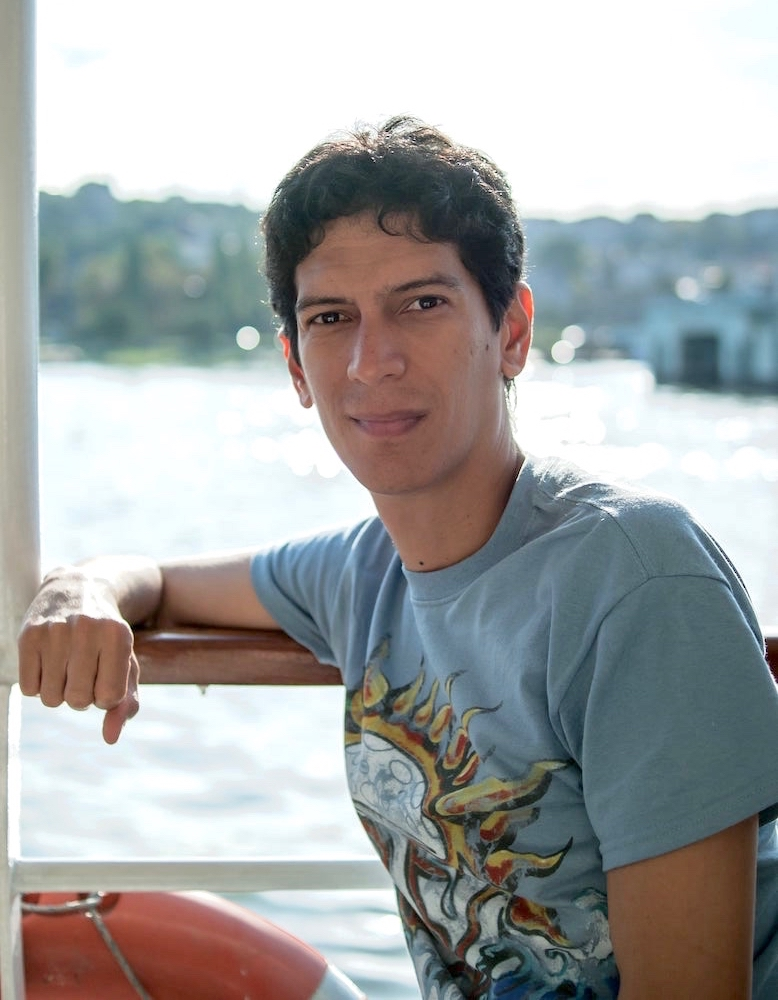

My name is Rolando Ramos and this is my personal website. Occasionally, I will write about software development, team management, and video games. From time to time I will get lucky and take a nice photo, which I will also post in here.

    

I was born and raised in Panama City, Panama, where I lived for most of my life. In 2003 I obtained a degree in Computer Science from [Harding University](https://www.harding.edu/comp/awards_honorgrads), located in Searcy, Arkansas. In 2006, I obtained an MBA from Universidad Antonio de Nebrija, located in Madrid, Spain. After living there for 8 years, I made a move to Zurich, Switzerland, where I currently reside.

I have been a software engineer for more than 10 years. This is not just something I do for work, as I also like to spend some of my free time with code and software!

You can find me on [LinkedIn](https://ch.linkedin.com/in/rolandoramosrestrepo), [Github](https://github.com/rolspace), and [Stack Overflow](https://stackoverflow.com/users/6909765/rolspace).

Enjoy!
