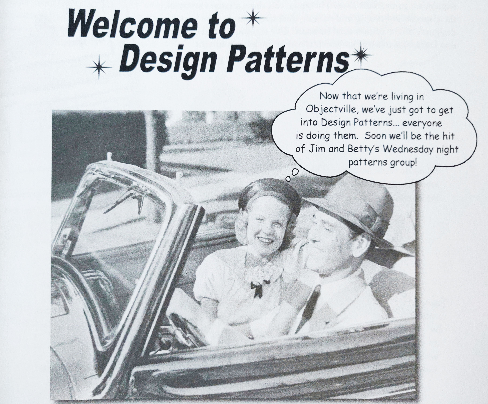

I finished reading this book a few days ago and now that I finished it, I thought it would be a good idea to write some comments on it.

<!--more-->

First off, for those who are familiar with design patterns, the book works very well as a wa yto refresh some of the conceptsand ideas related on object oriented design patterns. The chapters can be read in any order, for the most part.

The book is easy to read and there is no requirement to have an advanced English vocabulary to understand all the information in it. One of things I liked is that there are a lot of class diagrams for the patterns presented.

Even thought it is a technical book, it does not feel dense...in fact, there are quite a few attempts at humour throughout, though some of the jokes are a bit too silly.

Silly jokes aside, the book does a good job at teaching design patterns, even if you are already familiar with the topic.

For those who know C#, there is a repository with .NET implementations of the patterns covered in the book: https://github.com/d0pare/design-patterns
