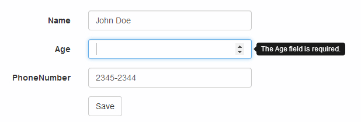

A few weeks ago I needed to change the way in which the unobtrusive validation messages were displayed in a form in an ASP.NET MVC application.

The reason was that the amount of space available in the window was limited and it was a requirement to display the correct validation messages, even though fitting them in the screen was kind of difficult.

I decided that the best option to solve this problem was to modify the way the validation messages were displayed in the form...instead of text messages next to the form input, the form would display the messages for each input as tooltips.

In this article I will show you how to achieve this.

<!--more-->

Let's create an Employee class with the class definition shown in the snippet below. A few data annotations have been added to the properties of the class in order to trigger specific validation messages.

```csharp
public class Employee
{
    [Required]
    public int Id { get; set; }

    [Required]
    public string Name { get; set; }

    [Required]
    public int Age { get; set; }

    [Phone]
    public string PhoneNumber { get; set; }
}
```

In order to edit items from this model, we will use a Razor view with a form that contains <code>Html.ValidationMessageFor</code> helper methods to display the validation errors for the Employee class properties.

```aspnet
<div class="form-group">
  @Html.LabelFor(model => model.Name, htmlAttributes: new { @class = "control-label col-md-2" })
  <div class="col-md-10">
    @Html.EditorFor(model => model.Name, new { htmlAttributes = new { @class = "form-control" } })
    @Html.ValidationMessageFor(model => model.Name, "", new { @class = "text-danger" })
  </div>
</div>
<div class="form-group">
  @Html.LabelFor(model => model.Age, htmlAttributes: new { @class = "control-label col-md-2" })
  <div class="col-md-10">
    @Html.EditorFor(model => model.Age, new { htmlAttributes = new { @class = "form-control" } })
    @Html.ValidationMessageFor(model => model.Age, "", new { @class = "text-danger" })
  </div>
</div>
<div class="form-group">
  @Html.LabelFor(model => model.PhoneNumber, htmlAttributes: new { @class = "control-label col-md-2" })
  <div class="col-md-10">
    @Html.EditorFor(model => model.PhoneNumber, new { htmlAttributes = new { @class = "form-control" } })
    @Html.ValidationMessageFor(model => model.PhoneNumber, "", new { @class = "text-danger" })
  </div>
</div>
<div class="form-group">
  <div class="col-md-offset-2 col-md-10">
    <input type="submit" value="Save" class="btn btn-default" />
  </div>
</div>
```

Such a view would provide the following result:


In order to modify how the unobstrusive validation messages are displayed, we need to access one of the methods provided by the jQuery Validator that is packaged with ASP.NET MVC v4. The <code>setDefaults</code> method allows us to modify the jQuery Validator's default settings.

For this specific scenario we need to modify the Validator's <code>showErrors</code> function. In an MVC application, the default <code>showErrors</code> function displaya the validation errors associated with a form input. An easy way to test this is to add the following script to the Razor view.

```javascript
$.validator.setDefaults({
  showErrors: function (errorMap, errorList) {},
})
```

In this case, unobtrusive validation will still work: the form will not submit if there are errors. However, there will be no error messages displayed. The <code>showErrors</code> function is called every time a validation event occurs (keyup, onblur, submit, etc). The two parameters in the function signature provide information about the elements being validated when the event is triggered.

The <code>errorMap</code> variable is an object with key/value pairs, where the keys refer to the name of an input field, and the values for these keys refer to the validation message for that input.

The <code>errorList</code> variable is an array of objects, where the objects in the array contain two properties: an element property (whose value is a DOM element) and a message property (whose value is the message specific to that DOM element).

Using this information, it is possible to create a new <code>showErrors</code> method that will allow us to display validation messages in a different manner:

```javascript
$.validator.setDefaults({
  showErrors: function (errorMap, errorList) {
    $('.valid').each(function (i, v) {
      $(v).tooltip('destroy')
    })
    $.each(errorList, function (i, v) {
      $(v.element).tooltip({ title: v.message, placement: 'right' })
    })
    this.defaultShowErrors()
  },
})
```

In this case we are using the <code>errorList</code> parameter to obtaina list of the validation errors in a form. When an element is invalid, a tooltip (provided by Bootstrap) is added in order to display the validation message.

If you want to remove the tooltip if the element becomes valid, we would take advantage of the <code>defaultShowErrors</code> function, which adds the valid CSS class to the form elements and helps to identify the inputs which are no longer invalid.

Since the <code>defaultShowErrors</code> method is being used, it is important to remove all the <code>Html.ValidationFor</code> helpers from the Razor View. This way only one set of validation messages will be displayed for the input elements:


